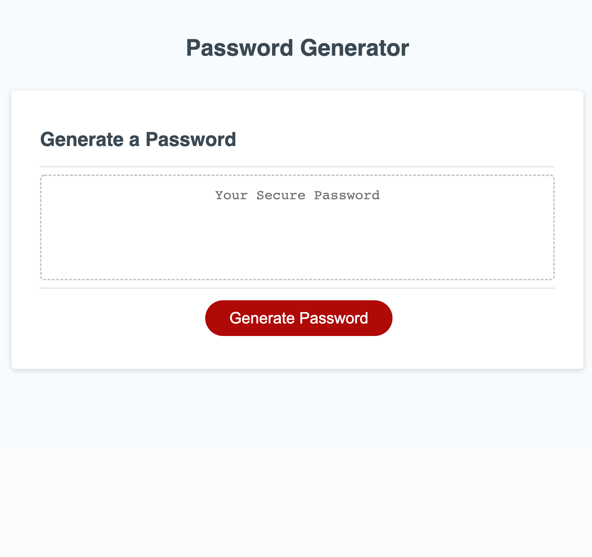

# <Random-Password-Generator>

## This was created in order to allow the client/user to generate a random password with characters of their choice. By working on this project, I have learned how to utilize events, loops, arrays and methods in more pratical ways.

## Links
- https://github.com/bburton5/random-password-generator
- https://bburton5.github.io/random-password-generator/

## Usage
This generator can be used to create random passwords for any user which provides safer, less guessable passwords.

## Credits
- StackOverflow
- MDN
- w3schools